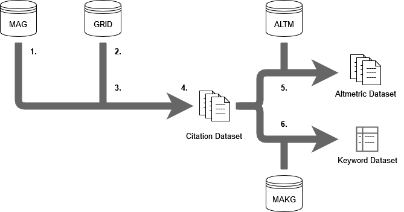

# Overview
Data and Code used for ["Analyzing the Impact of Companies on AI Research
Based on Publications"](https://doi.org/10.1007/s11192-023-04867-3) by Färber and Tampakis (2023) 

In "Data" you'll find the files that form the basis for the analysis: 
AllCit.tsv corresponds to the citation dataset from the paper. 
AllAlt.tsv corresponds to the altmetric dataset from the paper. 
The .csv files were produces on the basis of AllCit.tsv and were used for the creation of the figures.

In "Code" you'll find two Jupiter Notebooks: 
metrics.ipynb shows how the metrics were calculated. 
figures.ipynb shows how the figures were created.

For more information on the raw data and its preparation, read the data section of the paper or consult the authors.

# Contact or citation
[Michael Färber](https://sites.google.com/view/michaelfaerber), michael.faerber@kit.edu.  
Färber, M., Tampakis, L. Analyzing the impact of companies on AI research based on publications. Scientometrics (2023). https://doi.org/10.1007/s11192-023-04867-3
